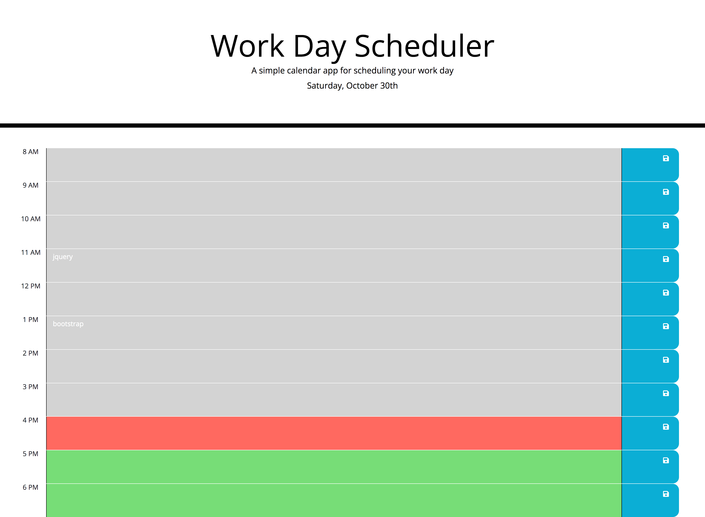

# Project Title: workdayschedule-third-party-api
Workday scheduler using 3rd Party API functionality

## Description
This application is designed for employees with a busy schedule.  It allows them to add important events to a daily planner and manage time effectively.  They can also keep track of where they are in their day with color coding.

**features**
 * Preset intial code given with assignment
 * Moment.js library to work with date and time
 * Uses Bootstrap for formatting of calendar
 * External Fonts
 * Uses JQuery to access calendar elements and make updates
 * Basic JAVAscript uses of functions, arrays and loops
 * Runs in the browser
 * Scroll down calendar to see all time slots
 * Time blocks for standard business hours 8 am to 6 pm (use of military time in javascript)
 * Save button to save revised tasks
 * Storage of revised tasks so when returning to schedule or refresed the screen they are populated
 * Complete READme file
 

**future features**
 * Ability to store more than one day
 * Additional edits so user is locked out when time has past
 * Prompt if text entered into area and user forgets to hit enter
 * Update to an alternative date function since Moment.js is considered legacy

## Executing Program
If you would like to view , you can access full code and documentation by visiting Dawn LeBlanc's Git Hub Repo https://github.com/dawnleblanc11/workdayschedule-third-party-api or view directly via https://dawnleblanc11.github.io/workdayschedule-third-party-api/.

## Help
All verification of usage was completed on a Google Chrome browser.

## Authors
Inital Code from Bootcamp
1.0 Inital Commit
1.1 Update README.MD
1.2 Inital Code Current Date
1.3 Refactor for JQuery
1.4 Progress on time compare
1.5 Time color changes
1.6 Task entry prep for storage
1.7 Local Storage set up
1.8 Change task storage
1.9 Add refresh function
1.10 Fixed saving task feature

Revisions Dawn LeBlanc 10-2021

## Version History
1.0 Inital Code outline
1.1 READme initalize
1.2 startercode timer
1.3 test QNA array
1.4 question variables
1.5 add scoring
1.6 add local storage
1.7 add CSS inital
1.8 updates to scoring
1.9 objects appearing
1.10 quiz box to appear on start
1.11 instant feedback section
1.12 high score section
1.13 progress with errors on high score page
1.14 questions pushing to screen
1.15 quiz scoring array
1.16 question speed fix
1.14 final score calculation
1.15 storing initals
1.16 update questions
1.17 progress with score array
1.18 time decrements
1.19 README updates

## License
N/A

## Acknowledgements
Shout out to TA Andrew for help with storage
